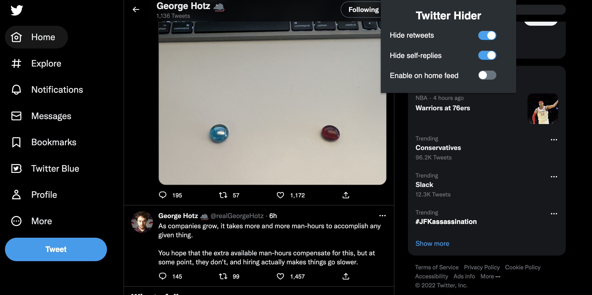

# Twitter Hider Chrome Extension
Twitter Hider is a simple Chrome extension that helps you declutter your Twitter feed by hiding retweets and self-replies. Retweets are tweets that have been reposted by other users, while self-replies are tweets that a user has written in response to their own tweet.

## Installation
To use the chrome extension, follow these steps:

1. Clone the repo

2. Open Google Chrome and type chrome://extensions in the address bar. This will open the Chrome extensions page.

3. Enable developer mode by clicking the toggle switch in the top-right corner of the page.

4. Click the "Load unpacked" button and select the directory where you cloned the repository.

The extension should now be loaded in your local browser. You may need to refresh the page for the changes to take effect.

## Usage
After installing the extension, a new button will appear in your Chrome toolbar. Click on this button to open the extension's options page.

On the options page, you can use the checkboxes to enable or disable the following options:

Hide retweets: Hides all retweets from your feed.
Hide self-replies: Hides all tweets that are replies to your own tweets.
Enable features on home feed: Enables the extension's features on the home feed.
Contributing
If you want to contribute to the development of the Twitter Hider extension, you can fork the repository on GitHub and submit a pull request with your changes.

## License
Twitter Hider is released under the MIT License.

## Credits
Twitter Hider was developed by Alex Albert.